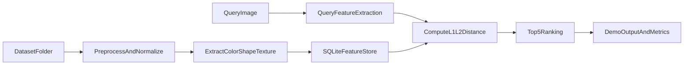

# Demo hệ thống CBIR tìm kiếm ảnh chim (C++ + SQLite)

## 1) Mục tiêu demo

Xây dựng bản demo hệ thống tìm kiếm ảnh chim tương đồng theo yêu cầu:
- Nguồn dữ liệu: `/Users/minhtuansfile/HoangTuan_Code/CBIR/Dataset`
- Input: 1 ảnh chim truy vấn (ảnh mới hoặc ảnh trong tập)
- Output: Top-5 ảnh giống nhất, sắp xếp theo độ tương đồng giảm dần (hoặc khoảng cách tăng dần)
- Công nghệ:
  - Xử lý ảnh và tính đặc trưng: C++
  - Lưu trữ và truy vấn dữ liệu đặc trưng: SQLite

---

## 2) Giả định dữ liệu và tiền xử lý

Theo yêu cầu đề bài, ảnh trong tập dữ liệu nên được chuẩn hóa theo:
- Cùng kích thước
- Cùng tỷ lệ khung hình
- Chim đang đậu, góc chụp ngang

Trong demo:
1. Resize ảnh về kích thước chuẩn (ví dụ `256x256`).
2. Chuẩn hóa màu (ví dụ chuyển từ RGB/BGR sang Lab hoặc HSI).
3. Tạo vùng quan tâm để giảm nhiễu nền:
   - Ưu tiên: vùng trung tâm (trọng số cao hơn theo PWH),
   - hoặc tách foreground đơn giản bằng ngưỡng màu/độ sáng.

---

## 3) Kiến trúc tổng thể



Luồng chính:
1. Indexing phase: duyệt toàn bộ `Dataset`, trích xuất vector đặc trưng, lưu vào SQLite.
2. Query phase: nhận ảnh truy vấn, trích xuất vector cùng chuẩn, tính khoảng cách với vector trong DB, trả top-5.

---

## 4) Bộ đặc trưng sử dụng trong demo

## 4.1 Đặc trưng màu sắc
- Color histogram trên không gian Lab/HSI (ví dụ `L:8 bins, a:8 bins, b:8 bins`).
- Có thể dùng PWH:
  - Chia ảnh thành lưới 3x3,
  - Vùng trung tâm nhân trọng số lớn hơn vùng biên.

Giá trị:
- Phân biệt hiệu quả các loài chim khác màu chủ đạo.
- Giảm tác động của nền nếu dùng PWH hoặc mask foreground.

## 4.2 Đặc trưng hình dạng
- Eccentricity (độ lệch tâm dựa trên contour chính).
- Hu invariant moments (7 moments).
- Grid-based binary descriptor:
  - Chia ROI chim thành lưới (ví dụ 8x8),
  - Mỗi ô lưu mật độ foreground (hoặc nhị phân theo ngưỡng 15%).

Giá trị:
- Phân biệt các loài có hình thái khác nhau (đuôi, mỏ, dáng thân).
- Tương đối ổn định với tịnh tiến/scale nhẹ.

## 4.3 Đặc trưng kết cấu
- Coarseness (độ thô/mịn cục bộ).
- Contrast (độ tương phản mức xám).
- Có thể dùng thêm thống kê đơn giản từ GLCM (nếu cần tăng phân biệt).

Giá trị:
- Tách các loài có màu gần giống nhau nhưng khác vằn/đốm/chất lông.

## 4.4 Ghép vector đặc trưng
- Vector cuối: `F = [F_color | F_shape | F_texture]`.
- Trước khi lưu/truy vấn:
  - Chuẩn hóa từng nhóm đặc trưng (min-max hoặc z-score).
  - Lưu kèm cấu hình để đảm bảo nhất quán giữa indexing/query.

---

## 5) Thiết kế cơ sở dữ liệu SQLite

## 5.1 Schema đề xuất

```sql
CREATE TABLE IF NOT EXISTS images (
  id INTEGER PRIMARY KEY AUTOINCREMENT,
  file_path TEXT NOT NULL UNIQUE,
  class_label TEXT,
  width INTEGER,
  height INTEGER,
  created_at TEXT DEFAULT CURRENT_TIMESTAMP
);

CREATE TABLE IF NOT EXISTS features (
  image_id INTEGER PRIMARY KEY,
  color_vec TEXT NOT NULL,
  shape_vec TEXT NOT NULL,
  texture_vec TEXT NOT NULL,
  full_vec TEXT NOT NULL,
  norm_version TEXT NOT NULL,
  FOREIGN KEY (image_id) REFERENCES images(id) ON DELETE CASCADE
);

CREATE INDEX IF NOT EXISTS idx_images_label ON images(class_label);
```

Ghi chú:
- Với demo SQLite, vector có thể lưu dạng `TEXT` (CSV) để đơn giản.
- Nếu muốn tối ưu hơn, có thể lưu dạng `BLOB` (mảng `float` nhị phân).
- SQLite không có ANN index native; tăng tốc bằng:
  - lọc trước theo metadata (nếu có),
  - cache vector vào RAM khi chạy query.

## 5.2 Metadata cần lưu
- `file_path`: đường dẫn ảnh tuyệt đối hoặc tương đối trong Dataset.
- `class_label`: suy ra từ tên thư mục cha (nếu dataset có phân lớp thư mục).
- `width`, `height`: phục vụ debug và kiểm soát tiền xử lý.

---

## 6) Độ tương đồng, xếp hạng và Top-5

Cho ảnh truy vấn có vector `Q`, ảnh trong DB có vector `D_i`.

- L1 distance:
  - `dist_L1(Q, D_i) = sum_j |Q_j - D_i_j|`
- L2 distance:
  - `dist_L2(Q, D_i) = sqrt(sum_j (Q_j - D_i_j)^2)`

Khoảng cách hợp nhất có trọng số:
- `dist(Q, D_i) = w_color * d_color + w_shape * d_shape + w_texture * d_texture`

Gợi ý trọng số ban đầu:
- `w_color = 0.5`, `w_shape = 0.3`, `w_texture = 0.2`

Quy tắc trả kết quả:
1. Tính `dist` với toàn bộ vector đã index.
2. Sắp xếp tăng dần theo `dist`.
3. Lấy 5 ảnh đầu tiên làm kết quả.

---

## 7) Tổ chức mã nguồn C++ (đề xuất)

```text
CBIR/
  src/
    main.cpp
    config.h
    image_preprocess.cpp
    feature_color.cpp
    feature_shape.cpp
    feature_texture.cpp
    feature_fusion.cpp
    sqlite_repo.cpp
    indexer.cpp
    searcher.cpp
  include/
  CMakeLists.txt
  Dataset/
  output/
```

Phân vai:
- `indexer`: duyệt dataset, tính vector, insert/update SQLite.
- `searcher`: nhận ảnh query, tính vector query, tính khoảng cách, trả top-5.
- `sqlite_repo`: quản lý kết nối, schema, câu lệnh CRUD.

---

## 8) Kịch bản demo chạy thực tế

## 8.1 Bước 1 - Build hệ thống
- Dùng `CMake` để build chương trình C++.
- Liên kết thư viện:
  - OpenCV (đọc ảnh + xử lý ảnh),
  - sqlite3 (lưu trữ và truy vấn).

Ví dụ:
```bash
mkdir -p build
cd build
cmake ..
cmake --build . --config Release
```

## 8.2 Bước 2 - Index dataset vào SQLite
Ví dụ lệnh:
```bash
./cbir_app --mode index \
  --dataset "/Users/minhtuansfile/HoangTuan_Code/CBIR/Dataset" \
  --db "./bird_cbir.db"
```

Kết quả mong đợi:
- Tạo DB và schema.
- Index toàn bộ ảnh hợp lệ.
- In thống kê:
  - số ảnh đã index,
  - thời gian xử lý trung bình/ảnh,
  - số lỗi đọc ảnh (nếu có).

## 8.3 Bước 3 - Chạy truy vấn ảnh mới
Ví dụ lệnh:
```bash
./cbir_app --mode query \
  --image "/path/to/query_bird.jpg" \
  --db "./bird_cbir.db" \
  --topk 5
```

Kết quả mong đợi:
- In vector đặc trưng query (hoặc chiều dài vector + checksum).
- In danh sách top-5:
  - rank,
  - file_path,
  - distance,
  - class_label (nếu có).
- Xuất file kết quả tại `output/query_result.json` hoặc `output/top5.txt`.

## 8.4 Kết quả trung gian cần trình bày trong demo
- Ảnh sau tiền xử lý/resize.
- Histogram màu (ít nhất 1 ví dụ).
- 1 ví dụ vector đặc trưng đầy đủ.
- Bảng distance của 10 ảnh gần nhất.
- Top-5 ảnh cuối cùng theo thứ tự.

---

## 9) Đánh giá hệ thống

## 9.1 Độ chính xác
- Metric chính: `Precision@5`.
- Cách tính đơn giản:
  - Nếu có `class_label`, đếm số ảnh cùng nhãn trong top-5.
  - `Precision@5 = (soAnhDungTrongTop5) / 5`.
- Nên test trên nhiều ảnh query (ví dụ 30-50 ảnh), lấy trung bình.

## 9.2 Tốc độ
- Đo:
  - thời gian indexing toàn bộ tập,
  - thời gian truy vấn trung bình 1 ảnh,
  - độ lệch chuẩn thời gian truy vấn.
- Mục tiêu demo:
  - query dưới 1 giây với ~500 ảnh (phụ thuộc máy).

## 9.3 Báo cáo lỗi và giới hạn
- Nhạy với nền phức tạp khi chưa tách foreground tốt.
- Vector lớn có thể làm truy vấn chậm nếu quét toàn bộ SQLite.
- Chưa có relevance feedback online trong bản demo cơ bản.

---

## 10) Hướng tối ưu tiếp theo

- Tách foreground tốt hơn (GrabCut/segmentation nâng cao).
- Dùng PCA giảm chiều vector trước khi lưu/truy vấn.
- Bổ sung index nhiều tầng:
  - lọc coarse theo histogram,
  - refine bằng vector đầy đủ.
- Thử nghiệm nhiều bộ trọng số `w_color/w_shape/w_texture`.

---

## 11) Checklist nghiệm thu demo

- [ ] Đọc được ảnh từ `/Users/minhtuansfile/HoangTuan_Code/CBIR/Dataset`
- [ ] Index đủ số lượng ảnh yêu cầu (>=500 nếu dữ liệu đáp ứng)
- [ ] Lưu thành công metadata + vector vào SQLite
- [ ] Truy vấn 1 ảnh bất kỳ trả đúng 5 kết quả
- [ ] Kết quả có ranking theo khoảng cách tăng dần
- [ ] Có hiển thị/log kết quả trung gian
- [ ] Có số liệu đánh giá accuracy (`Precision@5`) và tốc độ
- [ ] Có kết luận giới hạn và hướng cải tiến

---

## 12) Kết luận

Tài liệu này mô tả một demo CBIR ảnh chim có thể triển khai trực tiếp bằng C++ và SQLite, bám sát yêu cầu đề bài: sử dụng đặc trưng low-level (màu sắc, hình dạng, kết cấu), cơ chế so khớp theo khoảng cách, và trả về top-5 ảnh tương đồng để phục vụ trình diễn và đánh giá hệ thống.
